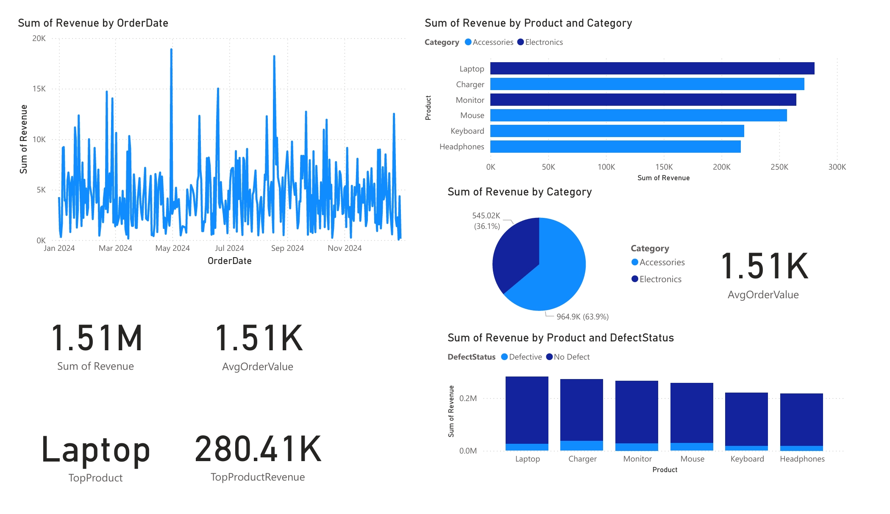

# 📊 Customer Sales Analytics Dashboard

## 📌 Overview
This project demonstrates how to analyze and visualize **sales data** using **SQL** and **Power BI**.  
The goal is to extract key business insights such as revenue trends, top-selling products, defect rates, and customer behavior.  

---

## 🚀 Features
- **KPI Cards**: Total Revenue, Total Orders, Average Order Value (AOV)  
- **Trend Analysis**: Monthly Revenue Growth  
- **Category & Product Insights**: Top Products by Revenue, Category-wise performance  
- **Defect Analysis**: % of Defective Orders  
- **Interactive Filters**: Date, Category, Product  

---

## 🛠 Tools & Technologies
- **Python (Pandas, Numpy)** → Synthetic dataset generation  
- **SQL (MySQL/XAMPP)** → Data queries and preprocessing  
- **Power BI** → Visualization & dashboard building  
- **Dataset** → 1000 synthetic sales records  

---

## 📂 Project Structure

```

Customer-Sales-Analytics-Dashboard/
│
├── generate_sales_data.py      
├── sales_data.csv              
├── SQL_Scripts.sql             
├── dashboard.pbix              
├── Power_BI_Dashboard          
└── README.md                   

```

---

## 📂 Dataset Generation
Since no real dataset was available, a synthetic dataset was generated using Python.

Run this script to regenerate `sales_data.csv`:

~~~bash
python generate_sales_data.py
~~~

This will create a dataset of 1000 sales transactions with fields:

- OrderID
- CustomerID
- OrderDate
- Product
- Category
- Quantity
- Price
- Revenue
- DefectStatus

---

## ⚙️ How to Run SQL Scripts

You can run the `SQL_Scripts.sql` file either using **MySQL Workbench** or **phpMyAdmin (XAMPP)**.

### Option 1: MySQL Workbench

~~~sql
CREATE DATABASE salesdb;
USE salesdb;

-- Load data from CSV (adjust path as needed)
LOAD DATA INFILE 'path/to/sales_data.csv'
INTO TABLE sales_data
FIELDS TERMINATED BY ','
ENCLOSED BY '"'
LINES TERMINATED BY '\n'
IGNORE 1 ROWS;
~~~

Then run queries from `SQL_Scripts.sql`.

### Option 2: phpMyAdmin (XAMPP)

1. Start XAMPP → Enable **Apache** and **MySQL**  
2. Open `http://localhost/phpmyadmin`  
3. Create database `salesdb`  
4. Import `sales_data.csv`  
5. Run `SQL_Scripts.sql` queries

---

## 📊 Dashboard Preview

👉 Replace the path(s) below with your screenshot path(s):



---

## 📈 Sample SQL Queries

~~~sql
-- Total Revenue
SELECT SUM(Revenue) AS TotalRevenue FROM sales_data;

-- Top 5 Products by Revenue
SELECT Product, SUM(Revenue) AS TotalRevenue
FROM sales_data
GROUP BY Product
ORDER BY TotalRevenue DESC
LIMIT 5;
~~~

---

## ✅ Key Insights (replace with your actual results)

- **Total Revenue:** ~$1.5M  
- **Average Order Value (AOV):** ~$1.51K  
- **Top Product:** Laptop — $280,408 revenue 
- **Defective Orders:** ~11% of total orders  
- **Revenue Peak:** [Apirl]

---

## 👤 Author

**Ganapathi Kashyap Lakkoju**  
📧 [glakkoju@gitam.in](mailto:glakkoju@gitam.in) | [LinkedIn](https://www.linkedin.com/in/lakkoju-ganapathi-kashyap-67508825a) | [GitHub](https://github.com/Kashyaplakkoju)

---

